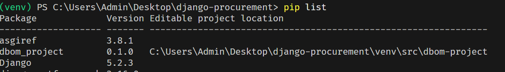

# django-procurement

to iomport DBOM projects from the DBOM database to the procurement database.
# Installation

```bash
pip install -r requirements.txt
```

```bash 
pip install -e git+https://github.com/Metaphi-Innovations/user-management-and-master-app-backend.git#egg=dbom_project
```

```bash
| Mode               | Command                                     | Use case          |
| ------------------ | ------------------------------------------- | ----------------- |
| Development        | `pip install -e git+https://github.com/...` | Live changes      |
| Production         | `pip install git+https://github.com/...`    | Deployment builds |
| `requirements.txt` | Use GitHub URL with `#egg=`                 | CI/CD compatible  |
```



mention the line in settings.py to import the DBOM project:

```python
sys.path.append(str(BASE_DIR / 'src' / 'dbom-project'))
```

python manage.py migrate
python manage.py runserver